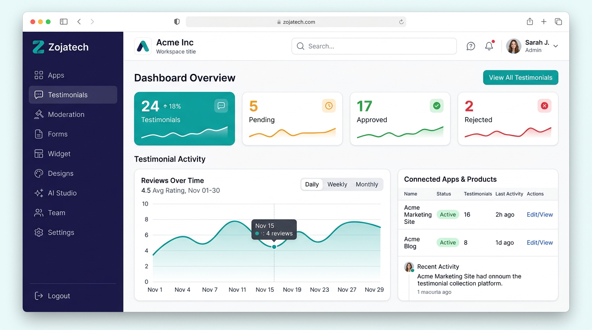
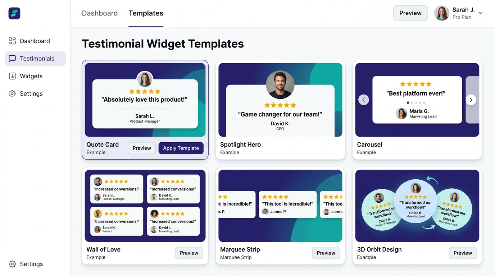
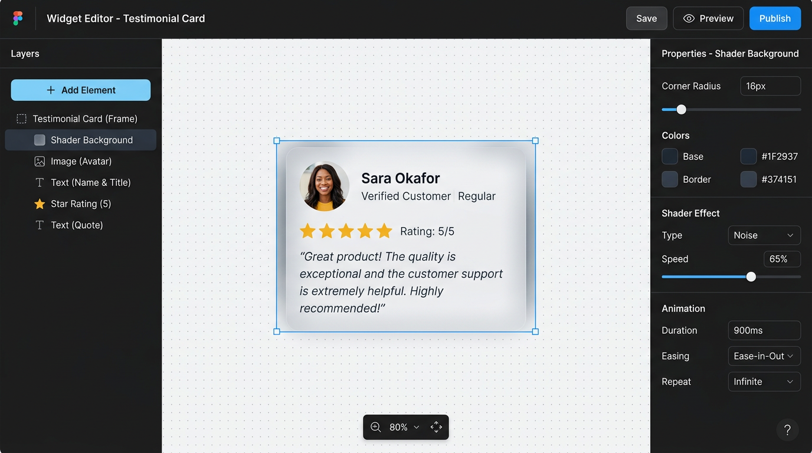
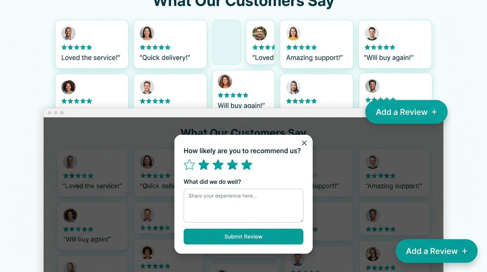
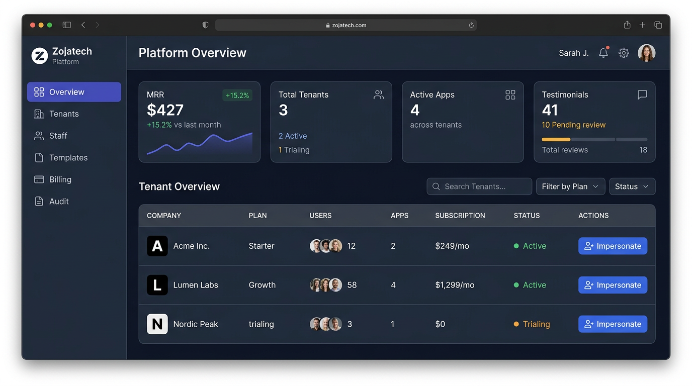

<p align="center">
  
</p>

<h1 align="center">Testimonial API · by Zojatech</h1>

<p align="center">
  Collect, moderate, design and embed customer testimonials — end to end.<br />
  A complete SaaS demo: <b>Express + TypeScript API</b>, <b>React + Vite + TypeScript UI</b>, in-memory seed data, and a public embed runtime.
</p>

<p align="center">
  <a href="#quick-start">Quick start</a> ·
  <a href="#whats-inside">What's inside</a> ·
  <a href="#architecture">Architecture</a> ·
  <a href="#screenshots">Screenshots</a> ·
  <a href="#api">API</a> ·
  <a href="#configuration">Configuration</a> ·
  <a href="#security">Security</a> ·
  <a href="docs/DOCUMENTATION.md">Full documentation →</a>
</p>

---

## What it is

Testimonial API (branded **Zojatech**) is a production-shaped SaaS app for turning happy customers into visible social proof on any website. It covers the entire loop:

1. **Collect** — share a public review link or drop a form on your site.
2. **Moderate** — every submission hits your queue before it goes live.
3. **Design** — pick from 30+ widget templates or build your own in a Figma-style studio.
4. **Publish** — copy an iframe + auto-sizing snippet onto your site; approved reviews render live.

It ships with **two applications in one**: a **company workspace** for customers (Acme Inc, Lumen Labs, Nordic Peak in the demo) and a **platform admin console** for the operator (Zojatech), plus anonymous **public forms & testimonial walls** that run on any website.

Everything runs with **zero external services**: install, start, click. The data is in-memory and seeded with demo accounts, products, reviews, forms and widgets — restarting resets to seed.

---

## Quick start

### Prerequisites
- Node.js **18+** (the codebase uses ES modules, `node:test`, and `tsx`).
- npm (ships with Node).

### Install & run

```bash
# 1. Clone and enter the repo
git clone <this-repo>
cd Testimonial-API

# 2. Install everything (root + server/ + client/)
npm install
# A postinstall hook cascades into server/ and client/ automatically.
# If you installed with --ignore-scripts, run `npm run install:all` instead.

# 3. Start BOTH the API and the web app
npm run dev
```

That's it.

| What | URL |
|---|---|
| Web app (React SPA) | <http://localhost:3001> |
| API (Express) | <http://localhost:3000> (proxied from the web app at `/v1/...`) |
| API health | <http://localhost:3000/health> |

Or run them separately:

```bash
npm run dev:server   # API only  -> http://localhost:3000
npm run dev:client   # Web only  -> http://localhost:3001
```

### Demo accounts

The login page shows one-click sign-in buttons, or you can sign in manually:

| Role | Email | Password | Where you land |
|---|---|---|---|
| Company owner (Acme Inc) | `owner@acme.test` | `demo1234` | `/app` — your apps |
| Company editor | `editor@acme.test` | `demo1234` | `/app` (reduced permissions) |
| Company viewer | `chris@acme.test` | `demo1234` | `/app` (read-only) |
| Platform super-admin (Zojatech) | `admin@zojatech.test` | `demo1234` | `/platform/overview` |
| Platform admin | `tolu@zojatech.test` | `demo1234` | `/platform/overview` |
| Platform editor | `kemi@zojatech.test` | `demo1234` | `/platform/overview` |

There is no marketing landing page — `/` redirects to `/login`.

### Try the full loop in 60 seconds

1. Click **Company workspace · Acme Inc** on the login screen → you land on **Your apps**.
2. Open **Acme Blog** → **Forms** → **Open ↗** on "Blog readers review" → submit a response.
3. Back inside the app, open **Moderation** — your submission is waiting. Click **Approve**.
4. It moves to **Testimonials**; toggle the eye icon to hide it from the wall without unapproving it.
5. Open **Widget** → pick a template → click **Preview & customize** to try the design studio.
6. Open **Connect** and copy the embed snippet, then sign out and sign in as **Zojatech Admin** to see the platform console, impersonate Acme, and browse the template marketplace.

### Scripts

| Command | What it does |
|---|---|
| `npm run dev` | Start API (`:3000`) and web app (`:3001`) together with `concurrently` |
| `npm run dev:server` / `npm run dev:client` | Start one side only |
| `npm run build` | Typecheck server + build the client (`client/dist`) |
| `npm run build:client` | Build just the client |
| `npm run typecheck` | Typecheck server + client |
| `npm test` / `npm run test:security` | Run the DOC-6 security suite |
| `npm start` | Run the production server (serves the API **and** `client/dist` same-origin) |
| `npm run install:all` | Install `server/` and `client/` dependencies manually |

---

## What's inside

### Company workspace

- **Apps home** — one "app" per website, each with its own isolated testimonials, forms and widget. Create new apps; a published review form is auto-created for you.
- **App overview & analytics** — pending/approved/rejected counts, a reviews-over-time line chart (30/90/all time, day/week/month buckets), and a collection funnel (received → approved → live on wall).
- **Testimonials library** — paged, searchable, tag-filterable. Full CRUD, live visibility toggle, bulk approve/reject/archive/show/hide/delete, CSV export.
- **Moderation queue** — approve, reject (with reason), archive. Permissions are enforced server-side.
- **Forms builder** — build public review forms with four question types (text, rating, video, select). Publish/unpublish with one toggle.
- **Widget gallery** — 30+ templates across families: classics (Quote Card, Spotlight Hero, Slim Strip, Rating Badge, Story Card, Bold Statement), interactive (Swipe Deck, Coverflow, Tilt Card, Aurora Glass with a live **GLSL shader** backdrop), and a 20-template **3D carousel family**. Six-per-page pagination with **Apply now** / **Preview & customize** actions.
- **No-code Builder** — step-by-step wizard: pick app → template → behavior → look, with live review previews at every step. Publish or save as draft.
- **Designs gallery** — every product's design in one place with mini-previews, draft badges, publish/discard and "New design" paths.
- **Design Studio** — Figma-style pan/zoom editor with a layers panel, + element popover (text/image/stars/shader/button), per-element properties (per-corner radius, shader presets with speed, entrance animations with duration/delay), a full-bleed immersive stage, and behavior controls (cycle / carousel / coverflow / wheel / stack / tilt / marquee).
- **Connect / embed hub** — exact live preview, step-by-step instructions, copy-paste iframe, an auto-sizing script (`widget/embed.js`) that scales fixed-dimension designs down on narrow screens, and a modal trigger.
- **AI Studio** — describe a widget in plain English; the built-in (deterministic, no external API) generator synthesizes palette, motion, canvas and layout, previews it with your real reviews, supports refine/regenerate/history, and one-click sends to draft or publish.
- **Wall of Love** — public, branded masonry of approved reviews with an "Add a Review +" CTA.
- **Theme & appearance** — choose a preset, fine-tune primary/accent/radius/font, upload a logo, or adopt a marketplace template as the company default.
- **Media library** — save image URLs for reuse in designs; deleting from the library never breaks published widgets.
- **Imports / API keys / Webhooks** — CSV-import jobs, scoped API keys (rotate-able), webhook subscriptions with delivery logs.
- **Team & roles** — invite members (owner/admin/editor/viewer), change roles, suspend/activate, reset passwords. The tenant owner cannot be demoted.
- **Audit log** — every write action in the workspace, scoped to your tenant only.
- **Account & workspace settings** — profile, email change (re-issues token), password change, workspace rename, brand color & logo.

### Platform admin console (Zojatech)

- **MRR overview** — aggregate revenue, tenant count, app count, testimonial counts, plus a per-tenant table.
- **Tenant directory** — search/filter/paginate tenants; create new tenants end-to-end (tenant + owner account + audit entry); edit plan/status/brand/owner; suspend (soft-delete); manage tenant theme remotely.
- **Impersonation** — drop into any tenant's workspace as the owner; blue banner; one-click exit that swaps back to your platform session.
- **Platform staff & RBAC** — create staff accounts with four roles (super admin / admin / editor / support). Self-promotion and self-deletion are blocked server-side.
- **Design & theme template marketplace** — CRUD for the catalogue tenants adopt.
- **Billing & invoices** — MRR plus recent invoices across all tenants.
- **Audit log** — platform events, optionally scoped to a single tenant or expanded to all tenants (super admin only).
- **AI providers / tasks / costs** — toggle providers and view AI task usage/costs.

### Public surfaces (no login)

- **Public review forms** at `/forms/:slug` — branded, theme-matched pages that accept submissions directly into the moderation queue.
- **Public testimonial walls** at `/walls/:appSlug` — the same widget runtime used in the studio, rendered with approved, visible reviews.
- **Theme endpoint** — pre-resolved theme tokens (brand color, accent, radius font) so any external site can match your brand.
- **Embeds** — drop-in `<script>` that injects an auto-sizing iframe running the live design.

---

## Architecture

```
┌────────────────────────┐       /v1/* (proxied)        ┌─────────────────────────┐
│  client/               │ ───────────────────────────► │  server/                │
│  React + Vite + TS     │                              │  Express + TS           │
│  :3001                 │ ◄────────── JSON ─────────── │  :3000                  │
│                        │                              │                         │
│  • Company workspace   │                              │  • routes/auth.ts       │
│  • Platform console    │       serves built client/   │  • routes/tenant.ts     │
│  • Design Studio       │ ◄──── dist in production ──  │  • routes/platform.ts   │
│  • Widget runtime      │                              │  • routes/public.ts     │
│  • Public form page    │                              │  • HMAC session tokens  │
│  • AI Studio (local)   │                              │  • In-memory seed data  │
└────────────────────────┘                              └─────────────────────────┘
        ▲
        │ <script>/<iframe> embed
        │
   Any customer website
```

Highlights:

- **No monorepo magic.** Root `package.json` only orchestrates `server/` and `client/` (each is its own npm package); a `postinstall` hook cascades `npm install` into both.
- **Stateless HMAC bearer tokens.** No cookies. The secret is auto-generated and persisted to `server/.session-secret` (mode `0600`, git-ignored) so sessions survive restarts. Tokens are accepted via `Authorization` header, `x-session-token` header, or `?session_token=` query param (for preview iframes that strip headers).
- **Zero dependencies beyond Express on the server.** No ORM, no auth framework, no validation library — the API is plain TypeScript for maximum readability.
- **Client stack:** React 18, react-router-dom v6, zustand, immer, framer-motion, recharts. Plain CSS (no Tailwind / CSS-in-JS).
- **Same-origin in production.** After `npm run build:client`, the Express server statically serves `client/dist` and falls back to `index.html` for SPA routes, so one Node process hosts everything.
- **CORS off by default.** Turn it on with `CORS_ORIGINS=https://app.example.com` only when the API and frontend live on different domains.

---

## Screenshots

### Company dashboard — manage all your products
<p align="center">
  
</p>

The workspace home shows every app/product you own, live counts for testimonials (pending/approved/rejected/archived), average ratings, and forms. Click any app to dive into its testimonials, moderation queue, forms and widget designer.

### 30+ widget templates, pick and publish
<p align="center">
  
</p>

Quote cards, Spotlight Hero, walls of love, carousels, marquees, orbit avatars, Tilt Cards and a 20-template 3D carousel family — with palettes from neon to editorial. Every template ships with the required rating components (review text, reviewer name, star rating). **Apply now** pushes it live instantly; **Preview & customize** opens the studio with an unpublished draft.

### Figma-style Design Studio — no drift between editor and live embed
<p align="center">
  
</p>

Pan/zoom canvas (space-drag, ⌘-wheel, Shift+0/Shift+1), layers panel with a **+** element picker, per-corner (or linked) radius, GLSL shader backdrops (aurora / plasma / mesh / starfield) with adjustable speed, entrance animations, full-bleed immersive mode, and a behavior editor for cycle/carousel/coverflow/wheel/stack/tilt/marquee. **Save** updates the draft; **Publish** is the only button that changes what visitors see.

### Public review forms & testimonial walls
<p align="center">
  
</p>

Visitors land on a branded, theme-matched form (or trigger it from a floating "Add a Review +" button on the wall). Submissions flow into your moderation queue; only approved + visible reviews render on the public wall, sorted and capped per your design options. The same widget runtime renders in the studio preview and on the public wall, so what you edit is exactly what visitors see.

### Platform admin console (Zojatech)
<p align="center">
  
</p>

See MRR across all tenants, drill into each company, impersonate any workspace with one click (blue banner + safe exit), manage platform staff with four RBAC roles, curate the template marketplace, view global audit logs and AI provider costs.

---

## Configuration

Configuration is optional — the app runs with zero env vars. Copy the example files when you want to change defaults:

```bash
cp server/.env.example server/.env
cp client/.env.example client/.env
```

### Server (`server/.env`)

| Variable | Default | Purpose |
|---|---|---|
| `PORT` | `3000` | API port. Update `VITE_API_PROXY_TARGET` if you change this. |
| `HOST` | `0.0.0.0` | Bind address (`127.0.0.1` = local-only). |
| `SESSION_SECRET` | *(auto-generated)* | HMAC token-signing secret. Set explicitly on read-only/deployed filesystems. |
| `SESSION_SECRET_FILE` | `server/.session-secret` | Where the auto-generated secret is persisted (mode `0600`, git-ignored). |
| `CORS_ORIGINS` | *(off)* | Comma-separated allowed origins, or `*` for any origin (dev only). Only needed when the frontend is deployed on a different domain. |

### Client (`client/.env`)

Only `VITE_`-prefixed variables reach the browser:

| Variable | Default | Purpose |
|---|---|---|
| `VITE_API_PROXY_TARGET` | `http://127.0.0.1:3000` | Dev server proxy for `/v1/*`. Keep in sync with the API's `PORT`. |
| `VITE_API_BASE` | *(same origin)* | Absolute API URL for deployed frontends (e.g. `https://api.example.com`). Also add the frontend origin to `CORS_ORIGINS` on the server. |
| `VITE_PORT` | `3001` | Vite dev server port. |

`.env` files are parsed by a tiny built-in reader (`server/src/env.ts`) — no `dotenv` dependency — and real environment variables always win over file values.

---

## API

Everything lives under `/v1`. All authenticated endpoints take an HMAC-signed bearer token. Full request/response details for every endpoint live in **[docs/DOCUMENTATION.md → §9 REST API reference](docs/DOCUMENTATION.md#9-rest-api-reference)**.

**Auth**
- `POST /v1/auth/login`, `POST /v1/platform/auth/login` — sign in, receive a token
- `POST /v1/auth/mfa/verify`, `POST /v1/auth/refresh`, `POST /v1/auth/onboarding`, `POST /v1/auth/invites/accept`
- `GET /v1/auth/me` — current user, tenant, permissions, impersonation state
- `POST /v1/auth/impersonation/exit` — swap back from impersonation

**Company workspace**
- Apps, widget templates, design drafts/schema/publish
- Testimonials (list/create/update/delete/bulk/moderate/export/tags)
- Forms, widgets, imports, API keys, webhooks + deliveries
- Account, team (with role templates), theme, identity, workspace settings, media library, audit logs, billing

**Public (no auth)**
- `GET /v1/public/theme-presets`, `GET /v1/public/theme/:appSlug`
- `GET /v1/public/forms/:slug`, `POST /v1/public/forms/:slug/submissions`
- `GET /v1/public/walls/:appSlug`

**Platform console**
- Overview (MRR + per-tenant metrics), tenant CRUD + impersonation
- Design templates & theme templates CRUD
- Platform staff CRUD with RBAC, billing & invoices, platform webhooks
- Audit logs (platform-only vs. all-tenants), AI providers/tasks/costs

**Health**
- `GET /health` → `{ ok: true, name: "testimonial-api", time }`

### How auth works (no cookies)

The API returns a stateless **HMAC-signed session token** on login. The client stores it in `localStorage` (with sessionStorage and in-memory fallbacks) and sends it as:

1. `Authorization: Bearer <token>` (primary)
2. `x-session-token: <token>` (iframe fallback)
3. `?session_token=<token>` (last resort, for environments that strip headers)

On a 401 the client retries once using the URL-channel token so embedded preview iframes keep working. Tokens embed the user's email and, for impersonation sessions, the admin who started them; they are verified with the secret on every request.

---

## Security (DOC-6)

The demo is hardened against every attack surface it exposes and ships with an automated security suite that runs in CI and blocks merges on failure.

```bash
npm run typecheck       # server + client
npm run test:security   # IDOR / RBAC / token-tamper / impersonation / input hygiene
npm run build:client
```

Highlights (see `server/test/security.test.ts` and **[docs/DOCUMENTATION.md §10](docs/DOCUMENTATION.md#10-security-model-doc-6)** for the full map):

- **Cross-tenant isolation.** Foreign app IDs return **404**, never an empty 200 — existence isn't confirmed (IDOR).
- **Per-handler RBAC.** Read/write/moderate/team/settings/billing are separate grants. Viewers and editors cannot moderate.
- **Tampered tokens → 401.** HMAC verification rejects anything unsigned by the persisted secret.
- **Input clamped everywhere.** Ratings clip to 1–5; free-text capped; form questions capped at 20; bulk IDs at 100; JSON bodies at 1 MB; design schemas at 400 KB; unknown question types default to `text`; only known question IDs are read on public submissions (mass-assignment defense).
- **Self-protection.** Can't demote/suspend the tenant owner; can't change your own role via Team management; platform staff can't remove themselves; suspended accounts receive 403 on every authenticated call.
- **Security headers** (`X-Content-Type-Options: nosniff`, `Referrer-Policy: no-referrer`); generic 500s so internals never leak; CORS off by default; logs strip query strings so `?session_token=` never lands in logs.
- **Session secret file is `0600` and git-ignored;** auto-generated on first run.

---

## Deployment

See **[`DEPLOYMENT.md`](DEPLOYMENT.md)** for notes on deploying to a single Node host, Vercel (monorepo config included at `vercel.json` and `client/vercel.json`), or Netlify (`client/public/_redirects` for SPA fallback).

For production:
1. Set `SESSION_SECRET` explicitly (so tokens survive redeploys without the persisted file).
2. Set `CORS_ORIGINS` only if your frontend runs on a different origin than the API.
3. Build the client (`npm run build:client`) and run `npm start` from the repo root — the Express server hosts both API and `client/dist` same-origin.
4. Remember data is **in-memory** in this demo; restarting the process resets it. Replace `server/src/demo-data.ts` with a real persistence layer (Postgres, etc.) for production use.

---

## Project layout

```
Testimonial-API/
├── package.json              # Root orchestrator (concurrently + cascading install)
├── README.md                 # This file
├── DEPLOYMENT.md             # Deployment notes
├── vercel.json               # Monorepo Vercel config
├── docs/
│   ├── DOCUMENTATION.md      # Complete product + API documentation
│   ├── integration-test-guide.md
│   └── images/               # Screenshots used in README and docs
├── server/                   # Express + TypeScript API
│   └── src/
│       ├── index.ts          # HTTP entry (HOST/PORT binding)
│       ├── app.ts            # Express app wiring (CORS, headers, routes, SPA fallback)
│       ├── env.ts            # Zero-dependency .env loader
│       ├── lib.ts            # Errors, auth guards, app scoping, pagination
│       ├── session-tokens.ts # HMAC stateless tokens + secret persistence
│       ├── demo-data.ts      # In-memory seeded store
│       ├── theme.ts          # Theme presets + resolution + patch parsing
│       ├── widget-templates.ts # 30+ template schemas + required-field validation
│       └── routes/
│           ├── auth.ts       # Login, MFA, me, impersonation exit
│           ├── tenant.ts     # Company workspace endpoints
│           ├── platform.ts   # Platform console endpoints
│           └── public.ts     # Public forms, walls, themes
│   └── test/security.test.ts # DOC-6 security suite (node --test)
├── client/                   # React + Vite + TypeScript SPA
│   ├── public/
│   │   ├── zojatech-logo.svg
│   │   └── widget/{embed,modal}.js  # Public embed scripts
│   └── src/
│       ├── App.tsx, main.tsx, auth.tsx, styles.css
│       ├── lib/              # API client, theme helpers, types, formatters
│       ├── components/       # Layout shell, modals, fields, UI primitives, icons
│       ├── design-studio/    # Figma-style editor (store, runtime, GLSL shaders,
│       │                     #   generator, snap-engine, animations, CSS)
│       ├── widgets/          # Embed runtime (classic/spotlight/carousel/wall/
│       │                     #   marquee/orbit) shared by studio & public pages
│       └── pages/            # All routes (workspace + platform + public)
└── legacy/                   # Previous Next.js + NestJS monorepo (kept for reference)
```

---

## Further reading

- 📘 **[Full product & API documentation](docs/DOCUMENTATION.md)** — every feature, every endpoint, every role permission, every design-system detail, explained in full.
- 🖥️ **[Visual & layout testing guide](docs/visual-testing-guide.md)** — headless-browser verification of the UI in restricted environments (works without a display; includes a screenshot workflow for vision-capable reviewers).
- 🚢 **[Deployment notes](DEPLOYMENT.md)**
- 🧪 **[Integration test guide](docs/integration-test-guide.md)**
- 🗂 **[`legacy/README.md`](legacy/README.md)** — notes on the preserved Next.js + NestJS codebase.

---

## License

This is a demo application. The previous Next.js + NestJS codebase is preserved under [`legacy/`](legacy/) for reference.
